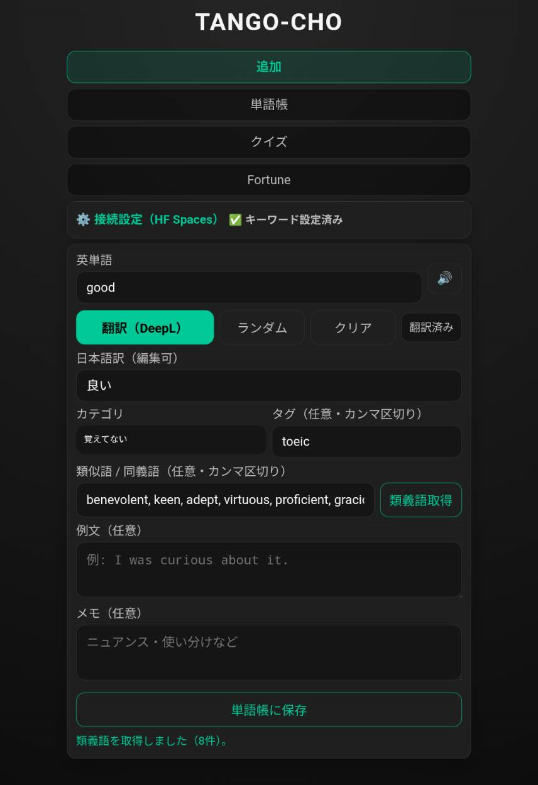
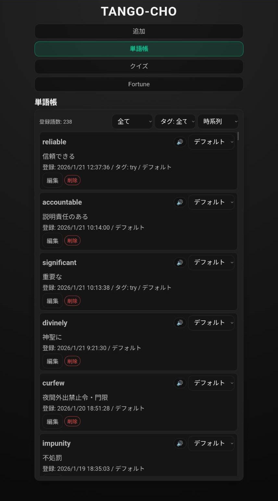
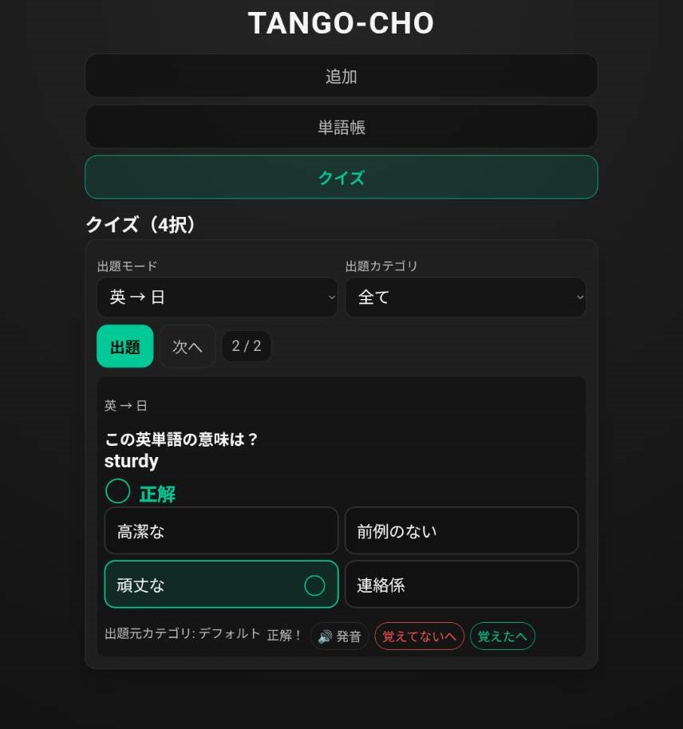
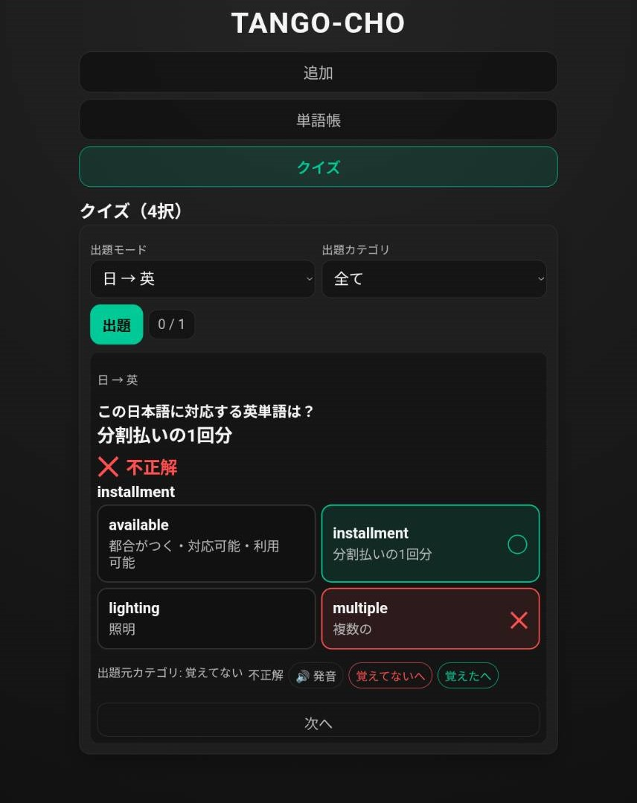

# TANGO-CHO（単語帳 × DeepL × 類義語 × 4択クイズ + Fortune(EN)）PWA 〔TOEIC寄り〕

英語を読んでいて分からない単語が出たら、**（見つける）→ アプリに持ち込む → 翻訳 → 保存**。  
集めた単語を **「覚えてない / デフォルト / 覚えた」** の3カテゴリで管理し、**4択クイズ**で復習できるPWAです。

加えて **星占い Fortune(EN)** で“まとまった英文”を生成し、文章の中から語彙を効率良く拾えるようにしています。  

制作：Masato Nasu

---

## Screenshots

| Add | List |
|---|---|
|  |  |

| Quiz | Fortune(EN) |
|---|---|
|  |  |

---

## Links

- **GitHub Pages（PWA）**  
  https://masato-nasu.github.io/TANGO-CHO/

- **Hugging Face Spaces（API / DeepL中継）**  
  - 稼働確認（Health）：`https://mazzgogo-tango-cho.hf.space/health`

---

## できること / Features

### 1) 追加（Add）
- 英単語を入力 → **翻訳（DeepL）** → 保存
- **類義語取得（手動）**：必要なときだけ押して取得（自動取得しません）
- **ランダム（TOEIC寄り）**（翻訳の隣）
  - 内蔵の語彙プールから **1語だけ** 引いて入力欄に入れます（候補一覧は出しません）
  - 乱数候補は **TOEIC寄り（ビジネス/旅行/オフィス）**を優先する重み付けになっています
- **タグ**登録（カンマ区切り：例 `business, email, toeic`）

### 2) 単語帳（List）
- 保存した単語を一覧表示
- ステータス（覚えてない/デフォルト/覚えた）で運用
- タグで絞り込み（タグフィルタ）
- 並び順：時系列 / ABC / タグ

### 3) クイズ（Quiz）
- 単語帳を元に **4択クイズ**で復習

### 4) 星占い Fortune(EN)
- **項目ごとの英文**を生成（例：Overall / Love / Work / Money / Health）
- **Target date** を変えて別日も占えます
- **JP** ボタンで、日本語訳を表示
- 生成文中の **単語をタップ**すると、**追加（Add）タブに転送**できます  
  → 翻訳 → 保存の流れが最短になります

---

## 初期設定：接続設定（HF Spaces）

翻訳（DeepL）や類義語取得を使う場合、Spaces のAPIを設定します。

1. アプリ内の **⚙️ 接続設定（HF Spaces）** を開く
2. **キーワード** を入力して **保存**  
   - ※ Spaces のURLはアプリ側で固定のため、入力不要です

---

## 使い方（最短ルート）

1. 追加（Add）で単語入力（またはランダム）
2. **翻訳（DeepL）**
3. 必要なら **類義語取得（手動）**
4. **保存**
5. 単語帳 → クイズで回す

---

## AndroidでWeb上の単語を持ってくる（共有でOK）

Android では、Webページ上の単語を **共有（Share）** から TANGO-CHO に渡せます。

### 方法：共有 → TANGO-CHO
1. Chrome 等で英単語を選択（長押しで選択）
2. メニューから **共有** を選ぶ
3. 共有先に **TANGO-CHO**（またはブラウザでTANGO-CHOを開く動線）が出る場合はそれを選択
4. 追加（Add）タブで翻訳 → 保存

※ 端末・OS・ブラウザにより共有メニューの表示が異なる場合があります。  
共有で出ない場合は「コピー → 追加（Add）に貼り付け」が確実です。

---

## こまめなバックアップ（JSON）

単語帳データは端末内（ローカル）に保存されます。  
機種変更やトラブルに備えて、**定期的にバックアップ**する運用をおすすめします。

- 保存：追加タブ → ⚙️ 接続設定 → **単語保存**（.json がダウンロードされます）
- 復元：追加タブ → ⚙️ 接続設定 → **単語復元**（保存した .json を選択）

復元前に「現在の単語帳を上書きする」確認が出ます。

---

## よくあるトラブル（更新が反映されない）

PWAはキャッシュの影響で古い版が残ることがあります。

- PC：**Ctrl + Shift + R**（強制リロード）
- Android：PWAをアンインストール → 再インストールが確実
- iPhone：ホーム画面から削除 → Safariのサイトデータ削除 → 再追加が確実

---

## データの保存先
- 単語帳データは端末内（ローカル）に保存されます（サインイン不要）

---

## Thanks
- DeepL API
- Hugging Face Spaces
- GitHub Pages / PWA
