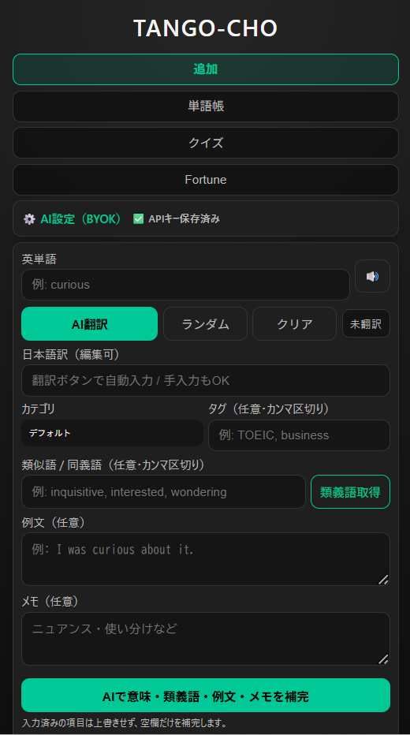
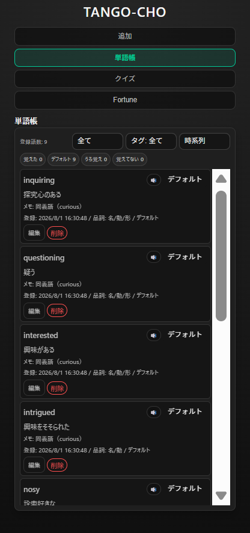
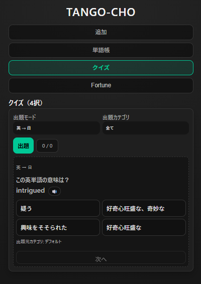
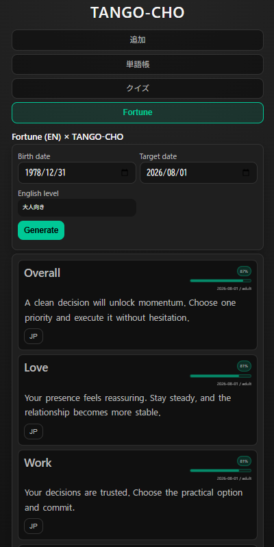

# TANGO-CHO（単語帳 × BYOK AI × 4択クイズ + Fortune(EN)）PWA〔TOEIC寄り〕

英語を読んでいて分からない単語が出たら、**見つける → 取り込む → 翻訳 → 保存**。  
集めた単語を **単語カード** と **4択クイズ** で回して定着させる、軽量PWAです。

- **Live Demo**：https://masato-nasu.github.io/TANGO-CHO/

---

## スクリーンショット / Screenshots

<table>
  <tr>
    <td></td>
    <td></td>
  </tr>
  <tr>
    <td></td>
    <td></td>
  </tr>
</table>

---

## できること / Features

- 📥 **単語の取り込み**
  - コピーした単語を貼り付けて追加
  - URLパラメータ `?word=` による受け取り（ショートカット等で活用）
- 🤝 **共有から一発登録（Android）**
  - Webページで単語を選択 → **共有** → **TANGO-CHO（TC）** で取り込み（最速導線）
- 🤖 **BYOK AI翻訳**（利用者自身のOpenAI APIキーで意味を取得）
- ✨ **AI一括補完**（意味・類義語・例文・ニュアンスメモ）
- 🧠 **類義語の提示**（語彙の広がり）
- 🃏 **単語カード**（意味・例文・発音・品詞をまとめて確認）
- ✅ **4択クイズ**（記憶の定着）
- 🎲 **ランダム**（単語カード / クイズの“迷ったらこれ”）
  - その日の気分でランダムに単語を引いて反復できます
- 🔊 **発音**（端末の音声読み上げ機能を利用）
- 🧭 **Fortune(EN)**（英文を読む “裏導線” としての学習導線）
- 🏷️ **品詞表示（名／動／形／副）**
  - アプリ内に同梱された辞書データにより、**追加単語でも自動で品詞候補を表示**
  - ※品詞は「断定」ではなく候補表示（誤学習を避ける方針）
- 💾 **JSONエクスポート／インポート**（バックアップ・共有）
  - iPhone/Androidどちらでも利用可能（方法は後述）

---

## AI設定（BYOK）

1. 「追加」画面の **⚙️ AI設定（BYOK）** を開く
2. OpenAI APIキーを入力
3. モデル名と例文レベルを確認
4. **接続テスト** を押す
5. 問題なければ **設定を保存**

APIキーはソースコードやGitHubには書き込まれません。AI機能を使わない場合も、単語帳・クイズ・Fortune・発音・バックアップは利用できます。

---

## 使い方 / How to use

### Android：共有から入れる（最速）
1. Webで英単語を選択（長押し）  
2. ブラウザの **共有** を開く  
3. 共有先から **TANGO-CHO（TC）** を選ぶ  
4. アプリ側で翻訳→保存

> 共有メニューの見え方は端末/ブラウザで少し異なりますが、流れは同じです。

### 1) 単語を追加する
1. 追加したい英単語を入力（または貼り付け）
2. AI翻訳、またはAI一括補完
3. 保存

> 追加後は「単語カード」で確認し、「クイズ」で反復するのがおすすめです。

### 2) クイズで回す
- 苦手単語だけ回す／ランダムで回す、などの導線で反復できます。
- 迷ったら **「ランダム」** ボタンで、その場で1語引いて回せます。

### Fortune(EN)：英文占いで“読む習慣”を作る（学習用の裏導線）
Fortune(EN) は、**短い英文を毎日読むための素材**として用意した機能です。  
「占いを当てる」ことが目的ではなく、**英文を読む → 分からない単語を拾う → 単語帳に入れる**ための“入口”です。

#### 占いの中身（星の動きを使っています）
- Fortune(EN) の文章は、**Birth date（生年月日）** と **Target date（対象日）** を元に、
  **天体の位置関係（角度の変化＝星の動き）** を使って組み立てています。
- いわゆる「ランダム文章」ではなく、日付が変わると（星の動きに合わせて）内容が自然に変化します。
- 目的は占いの的中ではなく、**“毎日ちょっと読む”ための英文素材**として活用することです。

1. アプリ内の **Fortune(EN)** を開く  
2. 表示された英文を読み、気になる単語を **コピー**  
3. TANGO-CHO の追加画面で **貼り付け → 翻訳 → 保存**  
4. その単語を **単語カード / クイズ** で回して定着

**コツ**
- 1日 **1〜3語だけ**拾う運用でも、継続すると効きます。
- その日の気分で、**ランダム**（単語カード / クイズ）と併用すると“回す”リズムが作りやすいです。

### 3) JSONでバックアップする
- データは端末内（ブラウザ内）に保存されます。  
  端末変更や不測の削除に備え、定期的にJSONエクスポートを推奨します。

---

## インストール（PWAとしてホーム画面に追加）

### iPhone（iOS）でのインストール手順
> **必ずSafariで**開いてください（LINE内ブラウザ/一部ブラウザだと「追加」が出ない場合があります）。

1. iPhoneで **Safari** を開く  
2. https://masato-nasu.github.io/TANGO-CHO/ を開く  
3. 画面下（または上）の **共有ボタン（□に↑）** をタップ  
4. **「ホーム画面に追加」** をタップ  
5. 名前を確認して **追加**

✅ ホーム画面のアイコンから起動すると、アドレスバーがない “アプリ表示” になります。

#### iPhoneで更新が反映されない場合（重要）
PWAはキャッシュが強いです。次の順でお試しください。

1) PWAを完全終了（アプリスイッチャーで上に払って終了）→ 再起動  
2) それでもダメなら：  
   **設定 → Safari → 詳細 → Webサイトデータ** で `masato-nasu.github.io` を削除 → 再度Safariで開く → もう一度「ホーム画面に追加」  
3) 最終手段：ホーム画面のTANGO-CHOアイコンを削除 → 再インストール

---

### Androidでのインストール手順
> 推奨：**Chrome**（一部ブラウザでも可能ですが表示が異なる場合があります）

1. Androidで **Chrome** を開く  
2. https://masato-nasu.github.io/TANGO-CHO/ を開く  
3. 右上の **︙（メニュー）** をタップ  
4. **「アプリをインストール」** もしくは **「ホーム画面に追加」** を選択  
5. 表示に従ってインストール

✅ ホーム画面にアイコンが作成され、アプリのように起動できます。

#### Androidで更新が反映されない場合
- Chromeで該当ページを開き、再読み込み  
- それでもダメなら（強め）：  
  Androidの設定から Chrome のサイトデータを削除、またはアプリ（PWA）を一度アンインストール→再インストール

---

## JSONインポート / エクスポート（バックアップ・共有）

### エクスポート（保存）
- アプリ内のエクスポート機能からJSONを出力し、端末へ保存します。

### インポート（復元）
- 保存したJSONを、アプリ内のインポート機能で読み込みます。

---

## データとプライバシー / Privacy
- 単語帳データは基本的に端末内（ブラウザストレージ）に保存されます。
- AI機能を実行したときだけ、入力された単語・フレーズがOpenAI APIへ送信されます。
- OpenAI APIキーは端末のブラウザストレージに保存され、単語帳バックアップには含まれません。
- 静的PWAからの直接通信であるため、**個人利用・自己ホスト向け**です。専用APIキーと低めの利用上限を設定し、共有端末では保存しないでください。一般公開サービスとして運用する場合は、APIキーをブラウザに置かず、バックエンド経由に変更してください。

---

## ライセンス / Third-party licenses

### Princeton WordNet
本アプリは、Princeton WordNet のデータに基づく「品詞（名詞/動詞/形容詞/副詞）ワードリスト」を同梱しています。  
Princeton WordNet のライセンス/利用条件については、以下を参照してください。

- WordNet License / Terms of Use:
  https://wordnet.princeton.edu/license-and-commercial-use

（同梱データの注記: [`data/WORDNET_LICENSE.txt`](data/WORDNET_LICENSE.txt)）

## v48.0.0 — BYOK AI版

固定のHugging Face Spaces／キーワード方式を廃止し、利用者自身のOpenAI APIキーでAI機能を使う構成に変更しました。

- AI翻訳
- 類義語取得
- 意味・類義語・例文・ニュアンスメモの一括補完
- 例文レベル（中学生／高校生／大人）の選択
- 類義語カード作成時の翻訳を1回の一括API呼び出しに集約
- APIキーはブラウザの `localStorage` にのみ保存
- APIキーは単語帳バックアップJSONには含めない
- モデル名は設定画面から変更可能（初期値: `gpt-5-mini`）

### APIキーについて

このPWAは静的なBYOKアプリのため、AI実行時にブラウザからOpenAI APIへ直接通信します。公開・共有端末ではAPIキーを保存しないでください。API利用料金は入力したキーのOpenAIアカウントに発生します。
